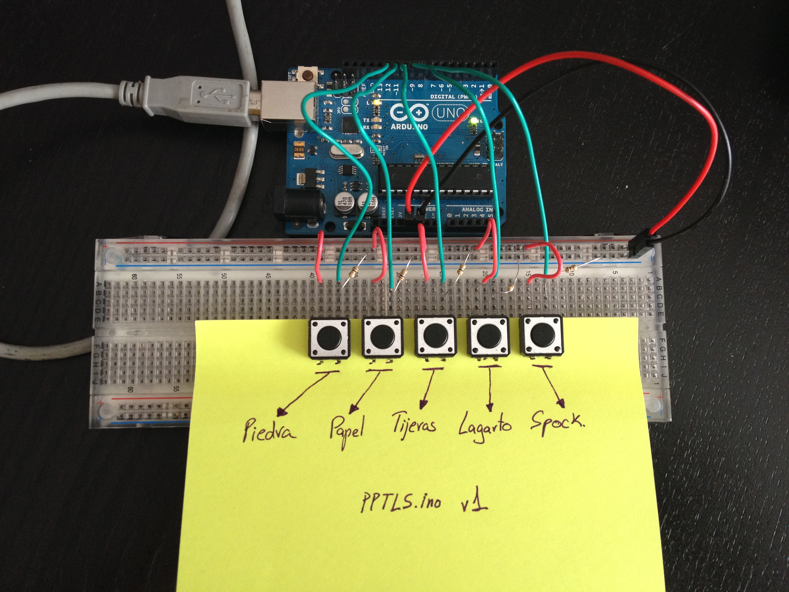
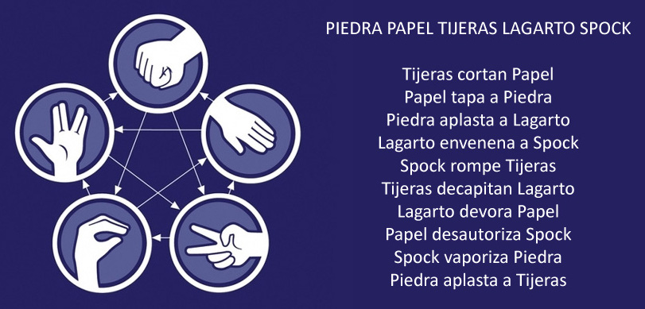

<h2 align="center">:warning: This repository is not longer maintained :warning:</h2>

# Piedra Papel tijeras Lagarto Spock con Arduino
El clásico de Big Bang Theory *Piedra papel tijeras largarto Spock* en Arduino.
[Video del capitulo](https://www.youtube.com/watch?v=_tsy4q9ibAE)

## Descripción:

- Arduino crea un número aleatorio entre 1 y 5, este número se corresponde a su vez con *piedra papel tijeras lagarto Spock*.
- El jugador selecciona con un botón su opción deseada.
- El sistema devuelve el resultado en forma de mensaje a través del serial.

## Lógica del juego:

- Piedra gana a tijeras y lagarto, pierde con papel y spock.
- Papel gana a piedra y spock, pierde con tijeras y lagarto.
- tijeras gana a papel y lagarto, pierde con piedra y spock. 
- Lagarto gana a spock y papel, pierde con piedra y tijeras.
- Spock gana a tijeras y piedra, pierde con papel y lagarto.

## Hardware necesario:

**IMPORTANTE:** Las resisténcias son necesarias, sino puedes dañar la placa e incluso provocar un incendio.

- Placa Arduino UNO o similar [x1]
- Pulsadores (x5) (Pines 8, 9, 10, 11 y 12)
- Resistencias 10K (x5)
- Un post-it a modo de interfaz (opcional)
[Fritzing file](pptls.fzz)

## Extra: 
- Versión en ingles del juego. Gracias [@NuriaHill](https://github.com/NuriaHill)
- Modo Debug. Imprime información por consola. Solo es necesario quitar el comentario en la línea 18
~~~
#define DEBUGMODE
~~~

## El código:

[Código fuente](pptls.ino)

## Ahora tu turno... 
¿Quien se anima con [Mono-Pirata-Robot-Ninja-Zombie](http://natleika.blogspot.com.es/2010/06/mono-pirata-robot-ninja-zombie.html) ?
